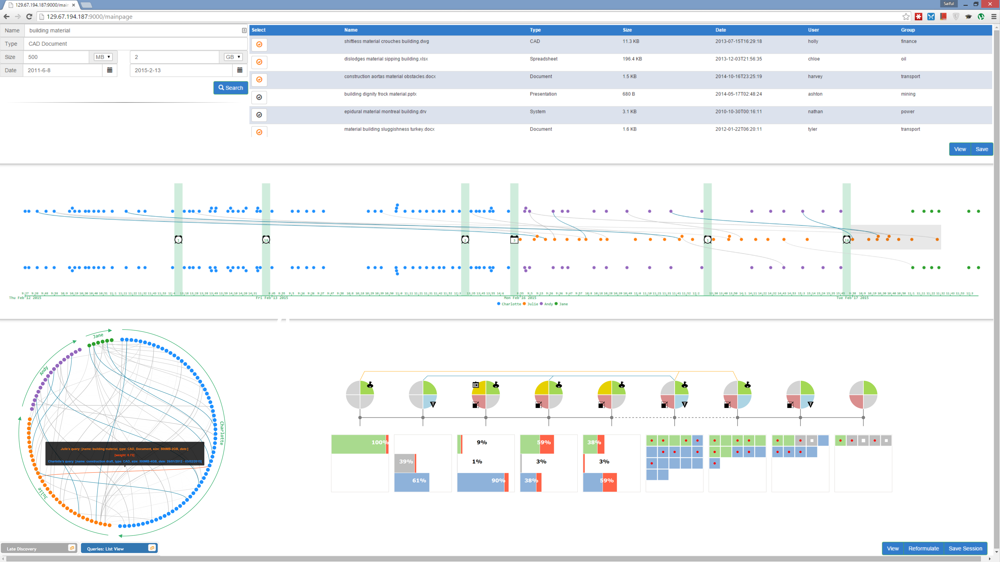
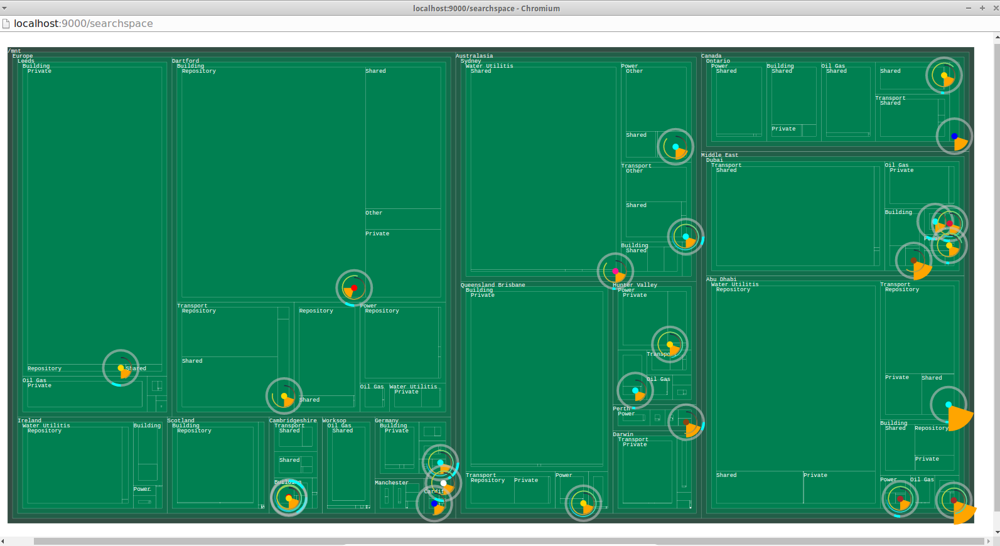

# About 
This is a research prototype of (a) an Enterprise Search Engine (C++) and (b) a Search Interface (Angular, d3). 

This repository contains the front-end or search UI.
The backend or search index in in [this repository](https://github.com/saifulkhan/dphil_project_search_index).

Search interface support two mazor functionalities (a) search result and search space visualization for rapid interpretation of search results and (b) search collaboration. 

Entire version of the prototype (part of my DPhil) is not open sourced. This code contains minimal comments and test cases.

 
# Prerequisites
node version: v0.10.33
npm version: 1.4.28

- `$ wget  https://nodejs.org/dist/v0.10.33/node-v0.10.33-linux-x64.tar.gz`
- `$ tar -xvf node-v0.10.33-linux-x64.tar.gz`
- `$ sudo cp -rf node-v0.10.33-linux-x64/* /usr/local/`

# Dependencies : Search Index backend 
The backend or search index in in [this repository](https://github.com/saifulkhan/dphil_project_search_index).

# Run

To install this project in your local machine and begin developping, you need to follow these steps:

- `sudo npm install`
- `bower install`
- `grunt serve` <-- run this project in development mode 

## Testing

- `grunt test:server` <-- to only run server tests.
- `grunt test:client` <-- to only run client tests.
 

# Screenshots
An example screenshoot of the user interface. Window 1 -

Window 2 -

# Publications

- **A Study on Glyph-based Visualisation with Dense Visual Context**. Saiful Khan, Karl J Proctor, Simon Walton, René Bañares-Alcántara, and Min Chen. In: *Computer Graphics and Visual Computing (CGVC), The Eurographics Association*, 73–80, 2014. DOI

- **Ontology-assisted Provenance Visualization for Supporting Enterprise Search of Engineering and Business Files**. Saiful Khan, Urszula Kanturska, Tom Waters, James Eaton, Rene Banares-Alcantara, and Min Chen. In: *Advanced Engineering Informatics*, 30(2):244–257, 2016. DOI

 
